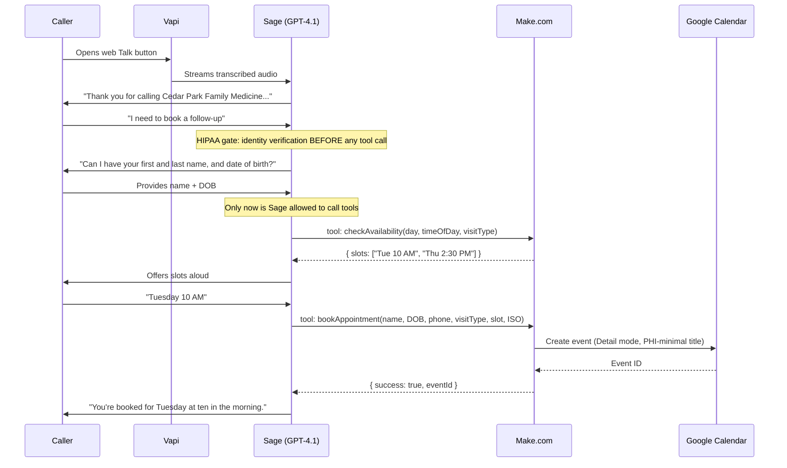
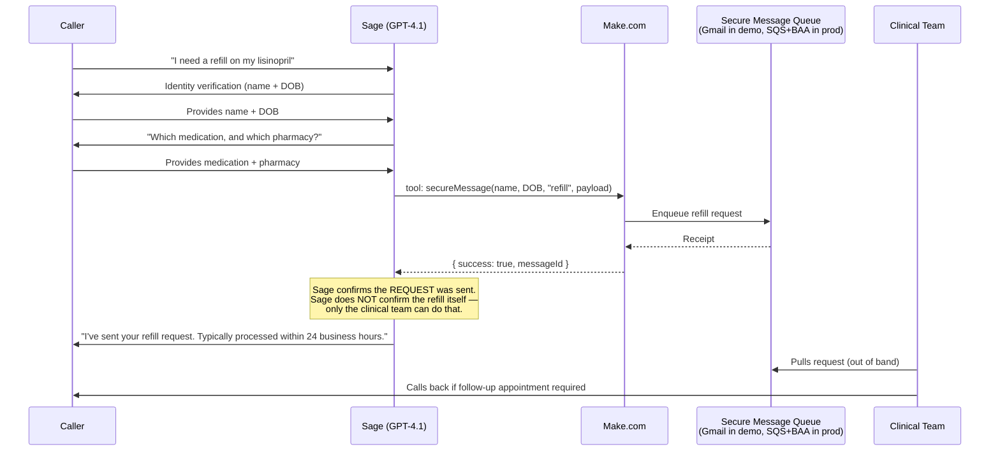

# Architecture

> **Demo vs. production:** what is built here is a working voice agent on **non-BAA infrastructure** — it is the right stack to *demonstrate* the design, but it is **not HIPAA-compliant as deployed**. The production migration path (BAA-covered vendors, encrypted queues, audit logging) is documented in [`BAA_VENDOR_MATRIX.md`](./BAA_VENDOR_MATRIX.md) and [`HIPAA_COMPLIANCE_AUDIT.md`](./HIPAA_COMPLIANCE_AUDIT.md). Treating those two docs as part of the deliverable is intentional — they are what separate a portfolio toy from a clinic-ready system.

## End-to-end call flow — existing patient booking (with identity verification)

## Prescription refill flow — secure message queue (NOT a direct calendar write)

End-to-end booking time (web Talk): ~75 seconds including identity verification. Cost per call on demo stack: ~$0.05.

## Why no phone number?

The Bright Smile Dental demo provisions a free Vapi US number (which routes through Twilio). For Cedar Park we **deliberately skip phone provisioning** and use the Vapi web Talk button only. Reason: Twilio does not sign a BAA at the free tier, and on the upgrade path it adds another vendor in the PHI-transit chain. For a HIPAA-positioned demo, every component that touches voice data is a BAA decision — fewer components, fewer decisions to make wrong. The production migration plan in [`BAA_VENDOR_MATRIX.md`](./BAA_VENDOR_MATRIX.md) re-introduces Twilio only on a BAA-covered plan.

## Components

### Vapi — voice orchestration
Real-time pipeline that fuses ASR, LLM, and TTS into a single conversational stream with sub-second latency.

- Assistant: `Cedar Park Family Medicine - Sage`
- Phone: **none provisioned** (web Talk only — see above)
- Transcriber: Deepgram Flux General
- LLM: OpenAI GPT-4.1
- Voice: Vapi built-in
- **BAA status (demo):** none. Production stack moves to Vapi Enterprise + Deepgram Enterprise (both sign BAAs). See vendor matrix.

### Sage — the LLM agent
GPT-4.1 driven by the system prompt at [`prompts/sage-system-prompt.md`](./prompts/sage-system-prompt.md). The prompt encodes five conversation flows:

1. New patient intake
2. Existing patient booking
3. Insurance verification
4. Prescription refill request
5. Urgent triage (with explicit 911 escalation script)

**HIPAA-critical prompt mechanics:**
- A `# Current Date and Time` section receives Vapi's `{{now}}` template variable. Without it GPT-4.1 hallucinates dates from 2024 and books appointments in the past.
- An **identity verification gate** in front of every tool call. Sage is explicitly forbidden from calling `checkAvailability` before collecting full name + DOB, because doing so implicitly confirms "this person is one of our patients" to whoever holds the line — which is itself a PHI disclosure.
- A **word-for-word 911 script** for emergency markers (chest pain, stroke signs, suicidal ideation, severe bleeding etc.). Hard-coded wording is easier to audit than improvised triage.

### Make.com — the workflow glue
Three HTTP-webhook scenarios bridge Vapi tool calls and downstream systems:

| Scenario | Inputs | Outputs | What it does |
|---|---|---|---|
| `checkAvailability` | `day`, `timeOfDay`, `visitType` | `{ slots: [...] }` | Returns 2–3 open slots within M–F 8 AM–6 PM Central |
| `bookAppointment` | `callerName`, `callerDOB`, `callerPhone`, `visitType`, `chosenSlot`, `startTimeISO` | `{ success: true, eventId }` | Writes a PHI-minimal event to Google Calendar (Detail mode) |
| `secureMessage` | `callerName`, `callerDOB`, `messageType` ("refill" / "triage" / "billing"), `payload` | `{ success: true, messageId }` | Enqueues a message for the clinical or billing team — **does not** send via SMS or any unencrypted channel |

`bookAppointment` uses Google Calendar's **Detail mode**, not Quickly mode. Quickly mode parses natural-language dates and was unreliable in the Bright Smile build — Detail mode takes the explicit ISO timestamp from Sage and writes deterministically.

**HIPAA flag on Make.com itself:** Make.com signs a BAA only on its Enterprise tier. The demo runs on a developer-tier account, which is fine for synthetic test data but **not** for real PHI. The production swap recommendation is AWS Lambda + EventBridge (Lambda is BAA-eligible under the AWS BAA), documented in the vendor matrix.

Scenario blueprints live in [`make-scenarios/`](./make-scenarios/).

### Secure message queue (the differentiating component)
In **demo**: a single Gmail inbox the clinical team checks. Synthetic test data only — never real PHI.

In **production**: an encrypted SQS queue with WORM-S3 archive, six-year retention to match HIPAA audit-log requirements, IAM-scoped access for the clinical team, and a dashboard for triage SLA tracking. Migration path in [`HIPAA_COMPLIANCE_AUDIT.md`](./HIPAA_COMPLIANCE_AUDIT.md) § "Audit logging."

The reason `secureMessage` is its own tool — rather than reusing a CRM-write or sending an email — is that prescription refills and triage requests have **patient safety** implications. An SMS to the front-desk phone can be missed; a Slack message lacks audit trail; a CRM ticket misses the queue-based "next available clinician" routing. Production deployments would also wire a paging tier for triage-priority messages.

### Google Calendar — the source of truth for scheduled appointments
Single dedicated calendar named "Cedar Park Family Medicine Demo" inside a synthetic Gmail account. Stores appointments with **PHI-minimal** event metadata: visit type and an internal patient ID rather than full name + DOB in the event title. Patient identifiers are kept in a separate (production) patient registry; the calendar event references the registry by ID.

**HIPAA flag on Google Calendar:** consumer Gmail/Workspace Free is **not** BAA-eligible. Production deployments migrate to Google Workspace Business Plus or Enterprise (BAA-eligible) or to an EHR-native scheduling system. Same vendor matrix entry.

## PHI flow map

What data crosses what boundary, and what protects it in each environment:

| Boundary | Demo stack | Production stack |
|---|---|---|
| Caller voice → ASR | Vapi free tier, Deepgram General. **No BAA.** | Vapi Enterprise + Deepgram Enterprise. Both under BAA. |
| ASR text → LLM | OpenAI GPT-4.1 standard API. **No BAA on free/pay-as-you-go; ZDR-API tier signs one.** | OpenAI Enterprise (ZDR-API) or Azure OpenAI under Microsoft BAA. |
| LLM → tool calls | HTTPS to Make.com. Make.com developer tier, **no BAA.** | AWS Lambda + API Gateway, under AWS BAA. |
| Tool calls → calendar | Google Calendar via consumer Gmail. **No BAA.** | Google Workspace Business Plus + BAA, or EHR-native scheduling. |
| Tool calls → secure queue | Single Gmail inbox. **No BAA.** Synthetic data only. | SQS + WORM-S3 archive under AWS BAA. |
| Call recordings + transcripts | None archived in demo. | S3 encrypted at rest, six-year retention, access logged. |

Every row of this table maps to a line in the BAA vendor matrix. The point of the demo is to prove the agent design works; the point of the matrix is to prove the operator knows how to lift it onto compliant infrastructure.

## Why this stack

- **Vapi over Retell or LiveKit:** simplest first-party tool integration, generous free tier, fast iteration. **Production-critical:** Vapi Enterprise signs BAAs — most lightweight voice platforms do not.
- **GPT-4.1 over GPT-4o:** more reliable tool-call structuring under strict verification-before-tool rules. Without GPT-4.1's tighter instruction adherence, Sage sometimes called `checkAvailability` before collecting DOB — a HIPAA risk because it implicitly confirms patient status.
- **Make.com over n8n for the demo:** lower learning curve, visual editor, instant webhook triggers. **Production swap:** AWS Lambda — see vendor matrix.
- **Web Talk only, no phone number:** removes Twilio from the PHI chain for the demo. See "Why no phone number?" above.
- **secureMessage as a dedicated tool:** prescription refills and triage require audit-logged routing, not best-effort SMS/email. Designed for the production queue architecture from day one.

## Production-readiness checklist

This repo is a **portfolio demo on non-BAA infrastructure**. A real Cedar Park deployment would require, at minimum:

### HIPAA infrastructure
- [ ] Sign BAAs with: Vapi Enterprise, Deepgram Enterprise, OpenAI (ZDR-API) or Azure OpenAI, AWS, Google Workspace, Twilio (if SMS/voice).
- [ ] Replace Make.com developer scenarios with AWS Lambda + API Gateway under the AWS BAA.
- [ ] Replace Gmail-inbox `secureMessage` sink with SQS + WORM-S3 archive (six-year retention).
- [ ] Move Google Calendar to Google Workspace Business Plus (BAA-eligible) or migrate scheduling into the EHR.
- [ ] Enable call recording archival to an encrypted S3 bucket with KMS-managed keys.
- [ ] Add PHI redaction on logs (mask DOB, MRN, etc. in CloudWatch / application logs).

### Application hardening
- [ ] Replace `checkAvailability` hardcoded slots with a real Google Calendar free/busy query.
- [ ] Wire EHR scheduling integration (Athena / Epic / Elation) once a target EHR is chosen.
- [ ] Add a fallback transfer-to-human number (warm transfer to front desk during hours, voicemail with PHI-safe greeting after hours).
- [ ] Per-clinic prompts and calendars for multi-tenant deployments.
- [ ] Patient-identifier registry external to Google Calendar; calendar events store internal IDs only.

### Compliance ops
- [ ] Workforce HIPAA training records on file for everyone with queue access.
- [ ] Quarterly access review for the `secureMessage` queue and call-recording bucket.
- [ ] Breach notification runbook (24 hr internal escalation, 60-day patient notice, 45-day TN state notice).
- [ ] Annual prompt-injection / identity-bypass penetration test on Sage.

The full compliance posture is mapped in [`HIPAA_COMPLIANCE_AUDIT.md`](./HIPAA_COMPLIANCE_AUDIT.md); the vendor decisions are in [`BAA_VENDOR_MATRIX.md`](./BAA_VENDOR_MATRIX.md). Both are written from the perspective of "what would a clinic's compliance officer need to sign off on before this goes live?" — which is the perspective a hiring client in this market actually evaluates against.
